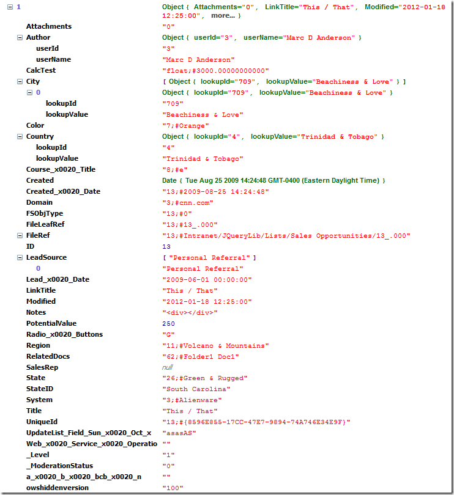

## Functionality

SPXmlToJson is a function to convert XML data into JSON for client-side processing.

## Syntax

``` javascript
$(xData.responseXML).SPFilterNode("z:row").SPXmlToJson({
  mapping: {},
  includeAllAttrs: false,
  removeOws: true,
  sparse: false // Added in 2014.01
});
```

SPXmlToJson operates on a nodeset from XML returned by a SharePoint Web Services operation. In the current implementation, the nodeset must be "flat", as in the z:row elements returned by [GetListItems](../core/web-services/Lists/GetListItems.md). In other words, the function doesn't handle any nesting.

### mapping

An array of columns to return in the JSON. While you should generally limit the values you request in your Web Services calls where you can, in some cases you won't have that capability. This option alows you to create "lean" JSON by only including the attributes you need. You can also rename the attributes for better compatibility with other jQuery plugins, for instance. Where it makes sense, the different column types (SPFieldType) are returned as analogous JavaScript objects. If not specified in the mapping, values are returned as strings.

The default value for mapping is `{}` (no mappings).

Currently supported objectTypes (SPFieldTypes):

| SPFieldType (Type) | JavaScript Object Type |
|--------------------|------------------------|
| Counter | int |
| Integer | int |
| DateTime / datetime | Date() |
| User | user = {userId, userName} |
| UserMulti | Array of User |
| Lookup* | lookup = {lookupId, lookupValue} |
| LookupMulti | Array of Lookup |
| Boolean | true / false |
| MultiChoice | Array of strings |
| Number / float | flota |
| Currency | float |
| Text | string object |
| Attachments** | Boolean string ["0", "1"] or Array of urls = {attachment, fileName} |
| Calculated | calculated = {type, value} |
| URL | url = {Url, Description} |

Additional formats are:

| objectType | JavaScript Object Type | Comments |
|------------|------------------------|----------|
| JSON | [object] | Useful when storing text-based JSON in a Single or Multiple line of text column. Added in 2014.01. |

Both the FileRef and FileDirRef have Type="Lookup". I have special cases in the code to parse those two columns out appropriately.

``` javascript
mapping: {
  ows_FileLeafRef: { mappedName: "Name", objectType: "Lookup" },
  ows_FileRef: { mappedName: "Url", objectType: "Lookup" }
}
```

If you would like just the text back so that you can parse it yourself, then stick with objectType: "Text" and parse it using `.split()`

`myFileRef = data[i].Url.split(";#")[1];`

By default, the Attachments column simply returns a value indicating whether or not attachments are present ["0", "1"]. If you specify the QueryOption `<IncludeAttachmentUrls>TRUE</IncludeAttachmentUrls>`, links to the attachments are returned instead.

### includeAllAttrs

If true, return all attributes, regardless whether they are in the mapping. The default is false.

### removeOws

Specifically for GetListItems, if true, the leading "ows_" will be stripped from the field name.

### sparse 

If true, empty ("") values will not be returned. The default is false. Added in 2014.01.

## Examples

This is the simplest example for using SPComplexToSimpleDropdown. You simply provide the nodeset:

``` javascript
$(xData.responseXML).SPFilterNode("z:row").SPXmlToJson();
```

In most cases, you'll pass in options which determine the structure of the JSON. Here is an example where I have provided mappings for a number of columns and I'm also including all of the attributes.

``` javascript
var myJson = $(xData.responseXML).SPFilterNode("z:row").SPXmlToJson({
   mapping: {
     ows_ID: {mappedName: "ID", objectType: "Counter"},
     ows_Title: {mappedName: "Title", objectType: "Text"},
     ows_Created: {mappedName: "Created", objectType: "DateTime"},
     ows_Author: {mappedName: "Author", objectType: "User"},
     ows_Country: {mappedName: "Country", objectType: "Lookup"},
     ows_City: {mappedName: "City", objectType: "LookupMulti"},
     ows_Lead_x0020_Source: {mappedName: "LeadSource", objectType: "MultiChoice"},
     ows_Sales_x0020_Rep: {mappedName: "SalesRep", objectType: "UserMulti"},
     ows_Potential_x0020_Value: {mappedName: "PotentialValue", objectType: "Currency"}
    },   // name, mappedName, objectType
   includeAllAttrs: true
  });
```

The results of the call above look like this, based on my test Sales Opportunities list:


