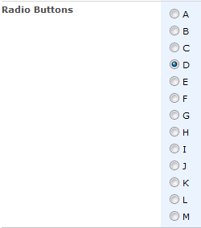

## Functionality

The SPArrangeChoices rearranges radio buttons or checkboxes in a form from vertical to horizontal display to save page real estate. If the column has "Allow 'Fill-in' choices:" set to 'Yes', the fill-in option will always remain at the bottom of the controls.

**Important notes:**

* In versions prior to v0.5.8, SPArrangeChoices did not work with Survey questions. If you want to use this function with Surveys, please upgrade to v0.5.8 or greater.
* If you are working with a customized form, you'll need to use a little trick to get this function to work. (Thanks to [alexlee797](http://www.codeplex.com/site/users/view/alexlee797) for pointing this out.) You'll need to add the following line:
	``` html
	<xsl:comment>FieldName="Display Name"</xsl:comment>
	```
	just above the
	``` html
	<SharePoint:FormField>
	```
	in the XSL of the custom form. You should replace 'Display Name' with the same value you supply for columnName in the function call.
	This is a little kludgy, but SharePoint doesn't render anything else for us to "hook into" for the radio button or checkbox columns. In an uncustomized form, this comment is already in the page; when you customize the form you need to add it manually.

## Syntax

``` javascript
$().SPServices.SPArrangeChoices({
	listName: "",
	columnName: "",
	perRow: 99,
	randomize: false
});
```

### listName
If specified, this list will be used to look up the column's attributes. By default, this is set at runtime to the list name for the current form's context based on the form's URL. You will not generally need to specify this value.

### columnName
The [DisplayName](../glossary.md#displayname) of the Choice column in the form. This function works with both radio buttons and checkboxes.

### perRow
The maximum number of choices to show per row.

### randomize
If true, randomize the order of the options.

## Examples

The screen snips below show the before and after views of columns with checkboxes (Lead Source) and radio buttons (Radio Buttons) when the following calls to SPArrangeChoices are in place.

``` javascript
$().SPServices.SPArrangeChoices({
	columnName: "Lead Source",
	perRow: 2
});
$().SPServices.SPArrangeChoices({
	columnName: "Radio Buttons",
	perRow: 7
});
```

Lead Source before:


Lead Source after:


Radio Buttons before:



Radio Buttons after:


