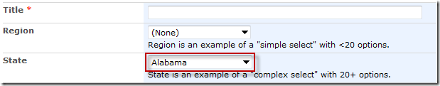

## Functionality

The SPComplexToSimpleDropdown function lets you convert a "complex" dropdown rendered by SharePoint in a form to a "simple" dropdown. It can work in conjunction with SPCascadeDropdowns; call SPComplexToSimpleDropdown **first**.

While this function doesn't use the SharePoint Web Services directly, it can be used with other SPServices functions which do.

SharePoint renders dropdowns differently in Internet Explorer depending on whether they have fewer than 20 options or 20+ options. (In Firefox, Chrome, and other browsers, SharePoint doesn't give us this "benefit".) You can read more about these differences in my blog post [Two Types of SharePoint Forms Dropdowns](http://sympmarc.com/2010/05/19/two-types-of-sharepoint-forms-dropdowns/).

In the example below, Region is a "simple" dropdown. because it has fewer than 20 options. State is a "complex" dropdown because it has 20+ options.


## How Does It Work?

The SPComplexToSimpleDropdown function works like this:

*   When the function is first called, it finds the dropdown control for the specified column name. If the control cannot be found and debug mode is enabled, an error is shown.
*   If the dropdown for the specified column is not a complex dropdown, we do nothing. This might be the case if the number of available options has decreased to fewer than 20, for instance.
*   The input element for the complex dropdown contains an attribute called `choices` which contains all of the available values and their IDs in one long vertical bar ("|") separated string, e.g., "`(None)|0|Alabama|18|Alaska|114|Alberta|16|Arizona|8|Arkansas|98|...`"
*   The function takes that string of values and builds up a simple select (the kind you are most likely familiar with) and prepends it to the table detail cell (TD) which contains the complex dropdown. The new simple select will have its id  set to `"SPComplexToSimpleDropdown_" + opt.columnName` for easy selection later, if needed.
*   Next we hide the original dropdown.
*   Finally, we attach to the change event for the simple select we have created. When a change occurs, we set the value of the complex dropdown to match the selected option and trigger a click event on the small dropdown image image, thus initiating some of SharePoint's native script to handle the change.  By maintaining the complex dropdown "as is", we can ensure that the proper value is stored in the list when the changes are committed.

Note that if the function fails for whatever reason, you should still be left with a working form.

## Prerequisites

There are no prerequisites for this function.

## Syntax

``` javascript
$().SPServices.SPComplexToSimpleDropdown({
	columnName: "",
	completefunc: null,
	debug: true
});
```

### columnName

The [DisplayName](../glossary.md#displayname) of the column in the form

### completefunc

If specified, the completefunc will be called each time there is a change to columnName. Potential uses for the completefunc: consistent default formatting overrides, additional lookup customizations, image manipulations, etc. You can pass your completefunc in either of these two ways:

``` javascript
completefunc: function() {
  ...do something...
},
```

or

``` javascript
completefunc: doSomething, // Where doSomething is the name of your function
```

### debug

Setting `debug: true` indicates that you would like to receive messages if anything obvious is wrong with the function call, like using a column name which doesn't exist. I call this [debug mode](../glossary.md#debug-mode).

## Examples

This is the simplest example for using SPComplexToSimpleDropdown. You simply provide the columnName:

``` javascript
$().SPServices.SPComplexToSimpleDropdown({
	columnName: "State"
});
```

and the complex dropdown (as shown in the image above) is converted to a simple dropdown:



If you'd like to convert all of the complex dropdowns in a form to simple dropdowns, you can use this trick from [DanKline](https://www.codeplex.com/site/users/view/DanKline), which he posted in this discussion thread [https://spservices.codeplex.com/discussions/443485](https://spservices.codeplex.com/discussions/443485)

``` javascript
$('.ms-lookuptypeintextbox').each(function() {  
  $().SPServices.SPComplexToSimpleDropdown({  
    columnName: $(this).attr('title')  
  });  
});
```
