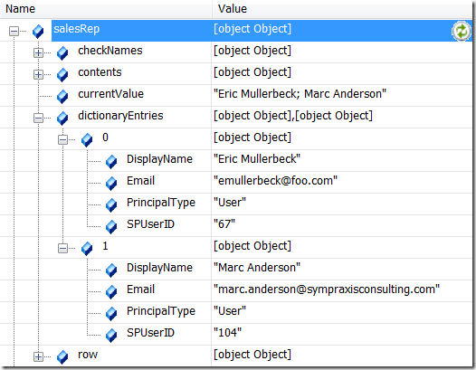

## Functionality

The SPFindPeoplePicker function helps you find and set People Picker columns. These little buggers are problem enough as it is, and selecting them and manipulating them with jQuery is something that a lot of people want to do. Add to that the fact that the People Picker is rendered differently in IE than in other browsers, and you have a challenge not unlike simple vs. complex dropdowns.

These are the columns which let us select known users in SharePoint, and they look something like this:


SPFindPeoplePicker allows you to get or set the values for People Pickers. When you call it with the [DisplayName](../glossary.md#displayname) of a People Picker, the function returns an object which contains information about the People Picker’s structure and current value.

**_IMPORTANT NOTE:_** In v0.7.2, this function was mistakenly named $().SPFindPeoplePicker. This was inconsistent with the other function namespacing. As of 2013.01, both $().SPServices.SPFindPeoplePicker and $().SPFindPeoplePicker will work.

## Syntax

``` javascript
$().SPServices.SPFindPeoplePicker({  
  peoplePickerDisplayName: "",  
  valueToSet: "",  
  checkNames: true  
});
```

### peoplePickerDisplayName
The [DisplayName](../glossary.md#displayname) of the People Picker in the form.   

### valueToSet
If you'd like to set the value of the People Picker, optionally provide it here.   

### checkNames
If you'd like to "click" on the Check Names icon to resolve the name in the People Picker, set checkNames to `true`. The default value is `true`.

## Returns

The function returns an object containing information and values which tell you about the People Picker you have specified:

### row

This is reference to the table row which contains the People Picker. This can be useful if you want to hide or show the row conditionally based on some user action.

### contents

The full contents of the `div[name='upLevelDiv']` element.

### currentValue

The current value set in the People Picker. If you pass a value into the function, it will be set and returned in this string. If there are multiple people specified, they are returned separated by semi-colons, as in the People Picker display.

### checkNames

This is a reference to the checkNames img tag in the People Picker. It’s used by the function to initiate resolution of a Person or Group value by firing the click event on it. Once you have this reference, you can do the same.

### dictionaryEntries

If the browser is Internet Explorer, then this object will contain the full dictionary entry values for each user or group in the People Picker value. If the browser is not IE, then the function calls [GetUserInfo](../core/web-services/UserGroup.md) to retrieve similar values to mirror the dictionary entry structure.

## Example

Assuming there is a People Picker in the form for a column named **Sales Rep** that is set to contain the two people Eric Mullerbeck and Marc Anderson:

``` javascript
var salesRep = $().SPFindPeoplePicker({  
  peoplePickerDisplayName: "Sales Rep"  
});
```

`salesRep` will be an object with the following attributes. There are considerable differences between how the People Picker works in different browsers; the example below is from Internet Explorer. In the function I try to "smooth over" those differences.


