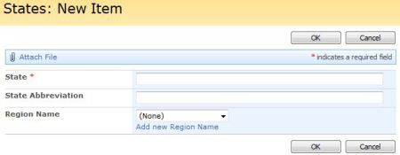

## Functionality

The SPLookupAddNew function allows you to provide a link in forms for Lookup columns so that the user can add new values to the Lookup list easily. It is based on [a blog post](https://blog.mastykarz.nl/extending-lookup-fields-add-new-item-option/) by Waldek Mastykarz.

## How Does It Work?

The function works like this:
1. Uses GetList for the current list to determine the details for lookupColumn
2. Uses GetList for the Lookup column's list to determine the list's URL
3. Uses GetFormCollection to get the URL for the NewItem form for the Lookup column's list
4. Appends the link to the Lookup columns's formbody table cell using the promptText provided
5. The link is enclosed in a DIV for easier manipulation with completefunc. The DIV's id takes the form: "SPLookupAddNew_" + lookupColumnStaticName, e.g., if the lookupColumn is 'a b c', then the id="SPLookupAddNew_a_x0020_b_x0020_c"

## Prerequisites

* The form displays a Lookup column.

## Syntax

``` javascript
$().SPServices.SPLookupAddNew({
	lookupColumn: "",
	promptText: "Add new {0}",
	newWindow: false,
	ContentTypeID: "",
	completefunc: null,
	debug: true
});
```

### Lookup column

The [DisplayName](../glossary.md#displayname) of the Lookup column in the form.

### promptText

The text to display as a link to add a new value to the lookup list. If you include the {0} placeholder, it will be replaced with the value of looukupColumn. The default value is "Add new {0}".

### newWindow

If true, the link will open in a new window without passing the Source. The default value is false.

### ContentTypeID

If ContentTypeID is specified, it will be passed on the Query String to the NewForm for the Lookup column's list. e.g., "/SiteName/NewForm.aspx?ContentTypeID=0x0100FD8C376B70E78A46974ECF1B10F8D7AD"

*completefunc*
If specified, the completefunc will be called upon successful completion of the call to SPLookupAddNew. Potential uses for the completefunc: consistent default formatting overrides, additional lookup customizations, image manipulations, etc. You can pass your completefunc in either of these two ways:
``` javascript
completefunc: function() {
  ...do something...
},
```

or

``` javascript
completefunc: doSomething,   // Where doSomething is the name of your function
```

### debug

Setting debug: true indicates that you would like to receive messages if anything obvious is wrong with the function call, like using a column name which doesn't exist. I call this [DebugMode](../glossary.md#debug-mode).

## Example

``` javascript
$(document).ready(function() {
	$().SPServices.SPLookupAddNew({
		lookupColumn: "Region Name",
		promptText: "Add new {0} "
	});
});
```



The prompt in this example will be 'Add new Region Name'. Other prompt examples:
* 'Add {0}' --> 'Add Region Name'
* 'Enter a new {0} if you want' --> 'Enter a new Region Name if you want'
* 'Add one' --> 'Add one' (by not providing the {0} placeholder, the lookupColumn name is not displayed)
